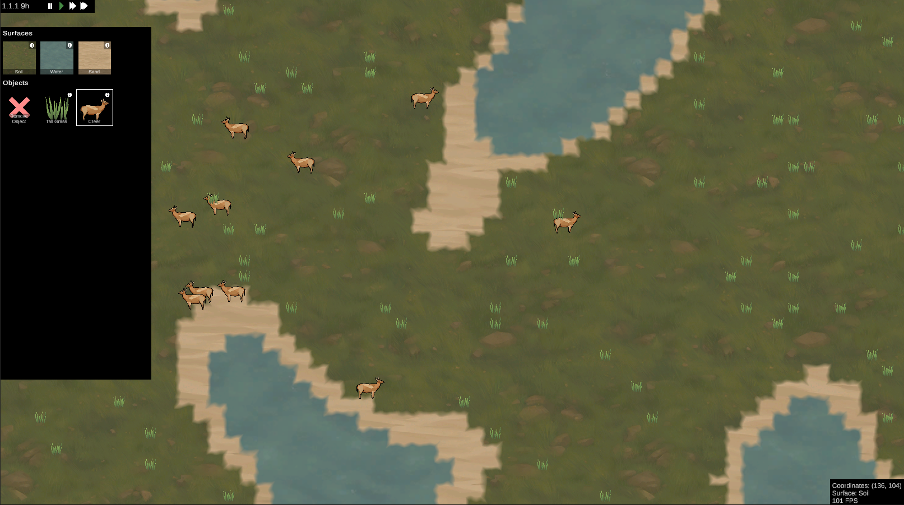

# About
In this Unity project I try to explore how emergent systems and mechanics work within a simulated ecosystem. 
The simulation takes place in a randomly generated world, which can freely be edited at runtime to influence to simulation. 
Everything within the simulation acts as an agent with their own logic of how it behaves. The behavioural rules of each agent are static and do not change during the simulation. There are no neural networks or similar learning mechanics in this simulation. The fixed rules are needed to make interactions understandable and reproducable and to be able to experiment with the systems that are given.

All agents are built as modularly as possible to allow the maximum amount of emergent interactions and to be able to create new ones without much effort.

# Screenshots
The artstyle is kept very simple to be able to focus on the systems and simulation itself.

*Version 2022-12-06*
  

# Credits
Terrain textures are from iFlashs "Clean Textures" Rimworld mod (https://steamcommunity.com/sharedfiles/filedetails/?id=2865361569&searchtext=clean+textures).
All other art is made by me (with some help from Stable Diffusion).